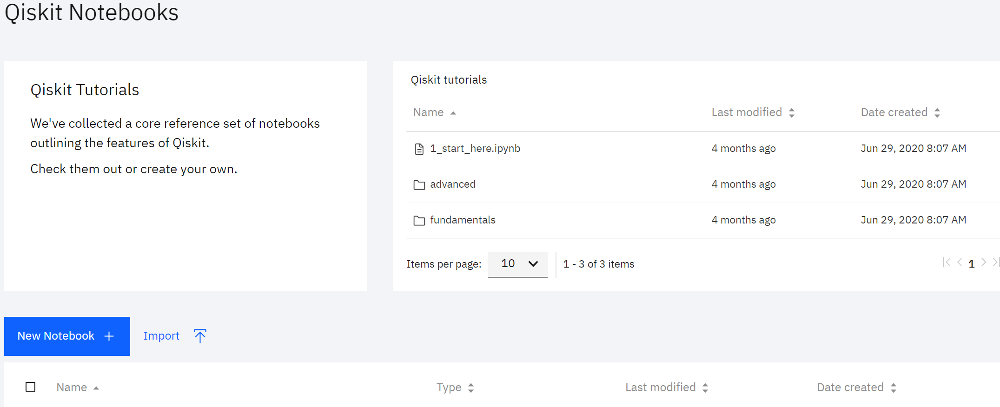
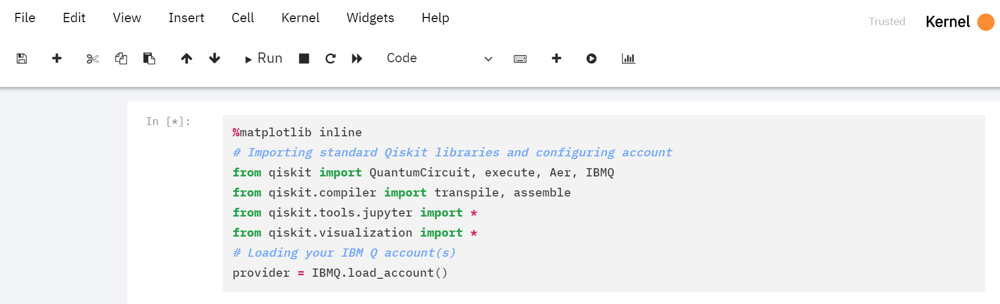
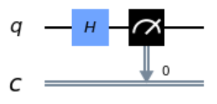

# Exploring Quantum Computing with Qiskit

These step-by-step instructions will guide you through running your first quantum program on a real quantum computer. The only pre-requisite is an account on the IBM Quantum Experience (http://ibm.co/iqx).

# Landing page

Below is an example of the page you'll see upon logging in to the IBM Quantum Experience website. In the middle are large buttons for launching the **composer** (for programming with a GUI) and **notebooks** (for programming with Qiskit); if a list of recent items appears instead of these buttons, the quick-access toolbar mentioned below can be used instead. Toward the bottom, you'll find lists of pending and completed **jobs**. On the right you'll find a list of quantum **backends** (i.e. real quantum devices or quantum simulators) to which you have access. Finally on the left you'll find a vertical toolbar for quick access to various resources.


# Starting a Qiskit notebook

Click the "Qiskit Notebooks" icon from the landing page or the quick-access toolbar, which will take you to the page shown below:



This page provides four options: load a pre-loaded tutorial notebook, create a new notebook from scratch, import a notebook from your computer, or load a previously saved notebook. Click "New Notebook" to create your own notebook from scratch.

A new notebook will load. As shown below, the first cell is already populated with code that loads some useful tools, so you're not working completely from scratch.


The **[\*]** on the left denotes that this cell is actively running; it is set to run automatically upon loading the notebook, and should take about 10 seconds. When it completes, the **[\*]** will be replaced by a **[1]**, where 1 indicates that this is the first cell that has been run in this notebook session.

# Writing your first quantum program

Our first quantum program will demonstrate the idea of **superposition**, one of the fundamental properties of the quantum world that is harnessed in quantum computing. Simply put, a quantum bit in a superposition state is neither 0 or 1 (which henceforth we will write as |0> or |1> to reflect the fact that we are referring to quantum states, not just the numbers 0 and 1), but some simultaneous combination of these states, which in the language of quantum physics can be expressed as a|0> + b|1>, where a and b are complex numbers. When a superposition state is measured, it **collapses** to either |0> (with probability |a|^2) or |1> (with probability |b|^2). From this, you can infer that we must have |a|^2 + |b|^2 = 1.

To demonstrate superposition, we'll build a **quantum circuit**, which is a series of operations (typically called **gates**) to be applied to a collection of quantum bits, along with a set of classical bits for storing the results of measurements. The code below defines a quantum circuit with 1 quantum bit and 1 classical bit. Type it in the blank cell just below the first one and hit Shift+Enter to run the cell.

```qc = QuantumCircuit(1,1)```

There are various ways to prepare a superposition state, but one of the simplest and certainly the most common is to start with a qubit in the |0> state (which is where all qubits are automatically initialized on IBM Quantum backends) and apply a **Hadamard** gate. This takes a qubit from |0> to the equal-weighted superposition state with a = b = sqrt(2), also referred to as the |+> state. More generally, it rotates a qubit's state 180 degrees around the axis equidistant between the X and Z axes of the Bloch sphere. To insert this gate into our quantum circuit, type the code below into a new cell and run it (the '0' refers to qubit index 0):

``` qc.h(0) ```

To see the effect of this gate on our qubit, we'll need to measure it. Use the line below to insert a measurement instruction that takes the result of measuring qubit 0 and stores it in bit 0 of the classical bit register:

``` qc.measure([0],[0]) ```

Congratulations: you have now written a (very simple) quantum program! You can view it as a quantum score:

```qc.draw()```



# Running your first quantum program

We are now ready to run our circuit on a **backend**, i.e. a real quantum device or a simulator. Since the real quantum devices sometimes have long queues, we'll want to find the least busy one:

```
from qiskit.providers.ibmq import least_busy
real_device = least_busy(provider.backends(simulator=False))
backend
```
This should display an interactive widget showing some properties of the least-busy real quantum device.

We can now launch a **job** to run our circuit. Since we are not expecting a definite result, we should have our job run the circuit many times in order to gather statistics, so we'll call for 1,000 **shots**.

```job1 = execute(qc, backend=real_device, shots=1000)```

We can get a pop-up widget for tracking the status of our jobs:
```%qiskit_job_watcher```

